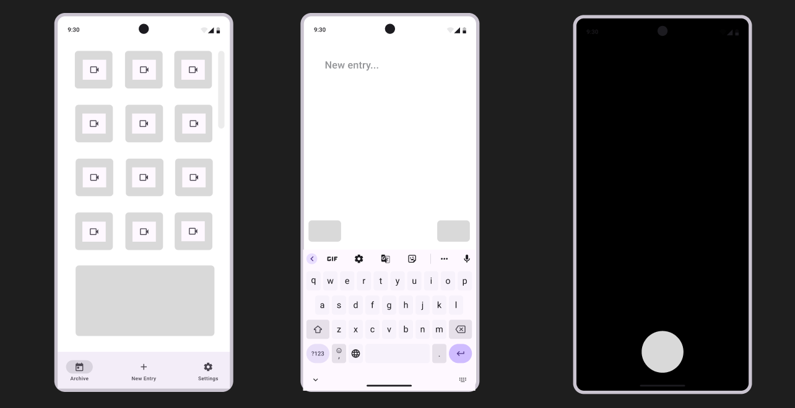

# CS501 Final Project - AI-Powered Journaling App  

## 📖 Introduction  
Journaling can be a powerful tool for self-reflection and personal growth, but many people struggle with consistency and knowing what to write. We decided to make a journaling app that makes the process more engaging.  

It will incorporate **AI-generated prompts** and **motivational features**. Similar to the app *BeReal*, each journal entry has a **photo to capture the moment** before the user starts writing.  

The app provides AI guidance, push notifications as reminders, and a streak system to encourage regular journaling. A calendar view will allow users to revisit past entries, and a delayed commenting feature enables reflection on older journal entries.  

Additionally, a *Snapchat*-inspired **Memories** function brings back past journal entries from the same date in previous years, causing nostalgia and increased self-awareness.  

For users who want deeper insights, the app will offer **automatic reflections** on their completed entries to provide personalized feedback and self-improvement suggestions.  

## 🔧 Backend & AI Integration  
The backend of the app will be built using **Firebase** as the database to store user accounts, journal entries, and push notification data.  

**Firebase Cloud Messaging** will handle reminders, ensuring users are notified at their preferred journaling time.  

The **Gemini API** will be used to handle all AI features, including generating writing prompts and providing reflections on past journal entries.  

The app also utilizes the **device’s camera as a sensor**, requiring users to take a photo before beginning each journal entry. This is to **force the user to capture a real-life moment** before writing an entry for the journal.  

## 📱 Target Platforms  
Testing will focus on **smartphones and tablets**.  

Phones are the most commonly used mobile devices and provide a convenient platform for quick journal entries. It is easiest for a user to take a picture with a phone.  

Tablets have a **larger screen**, making them ideal for a more immersive writing experience. The interface will be designed to **adapt to different device sizes and orientations**.  

## 🏠 User Interface & Experience  
The app’s interface will have a **calendar-based home screen** where users can access past entries.  

A **bottom navigation bar** will provide access to **new journal entries, streak tracking, and settings**.  

When creating a new entry, users will first **capture a photo**, followed by a **text entry screen**, where they can either **write freely** or generate an **AI prompt** using a button.  

**AI-generated reflections** will be accessible after completing an entry, offering insights tailored to the user’s writing.  

## 🖼️ Figma Sketch  
Here is a preview of the initial Figma design for the app:  

